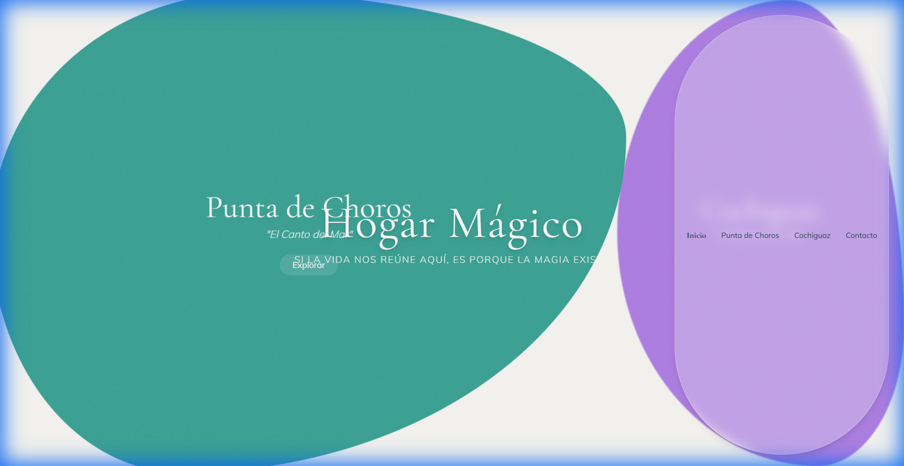
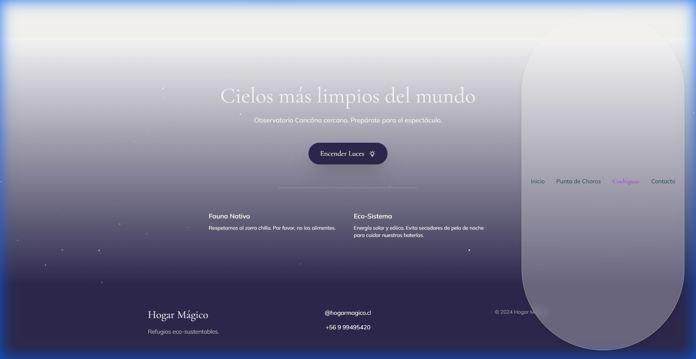

# Walkthrough: Hogar Mágico "Organic" Website

We have successfully built the "Anti-Template" website for Hogar Mágico. The design strictly follows the organic morphology, color palette, and physics requested.

## 1. The "Portal" (Index Page)
**Feature:** Split-screen Hero with "Day vs Night" / "Sea vs Valley" theme.
**Physics:** The blobs expand on hover, shifting the focus fluidly.
**Manifesto:** entrance animations triggered on scroll.

## 2. Casa La Chascona (Adobe & Wood)
**Feature:** "Arch" mask hero image (`border-radius: 50% 50% 0 0`).
**Gallery:** Masonry layout with rustic imagery.
**Physics:** Smooth entrance animations.

## 3. Casa La Mar (Infinite Horizon)
**Feature:** "Gentle Wave" SVG mask at the bottom of the hero.
**Gallery:** Horizontal scroll (Snap-x) for panoramic views.

## 4. Casa La Calma (Zen & Night)
**Feature:** "Night Mode" Interaction.
**Trigger:** Clicking "Apagar Luces" transforms the page logic.
**Visuals:** Background shifts to Deep Indigo (`#2E294E`) and CSS-generated starts appear twinkling.

## Technical Summary
- **Stack:** HTML5, Tailwind CSS (CDN), Vanilla JS.
- **Organic Shapes:** Created via custom `.blob-shape` and `.arch-mask` utilities in `css/styles.css`.
- **Performance:** No heavy frameworks. `IntersectionObserver` handles animations efficiently.
- **Verification:** Tested on Localhost. Navigation, Hovers, Toggles are fully functional. No console errors.
